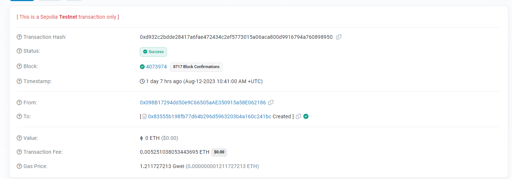
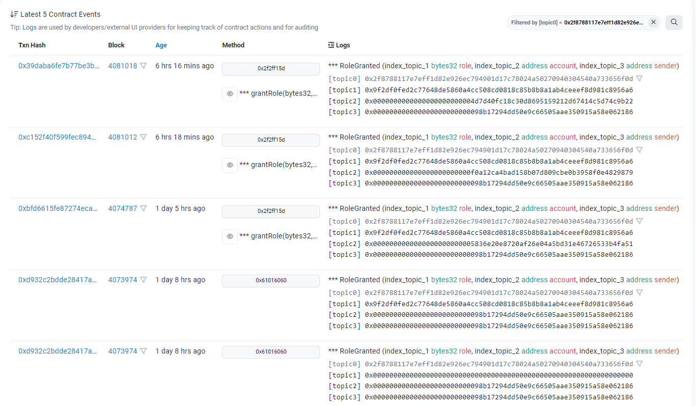
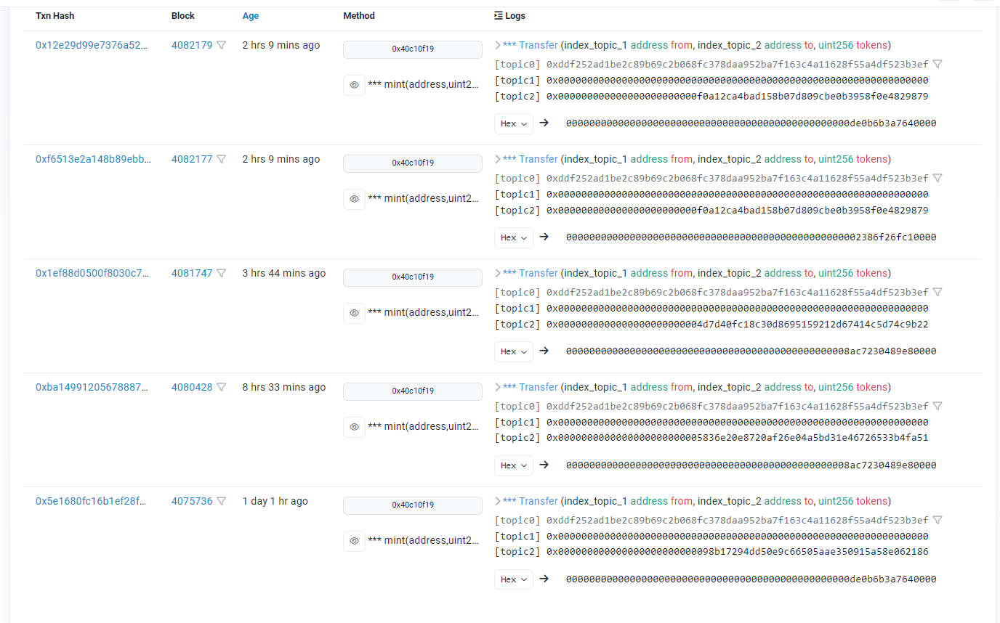
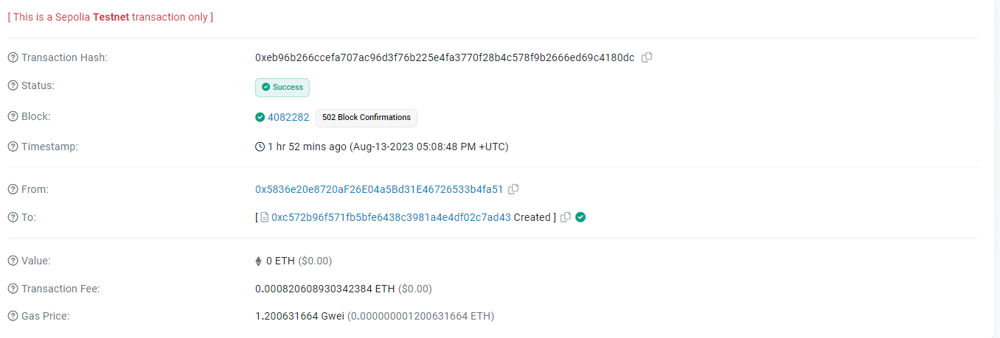
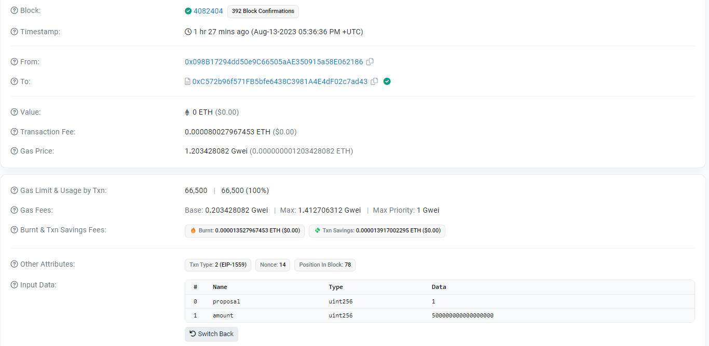
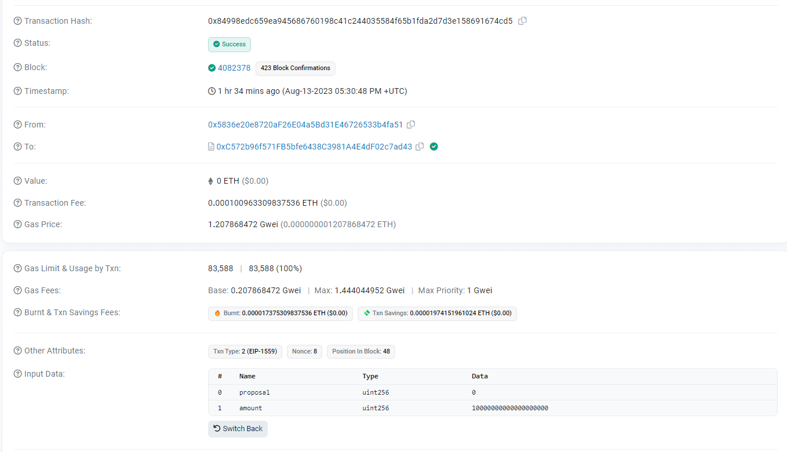
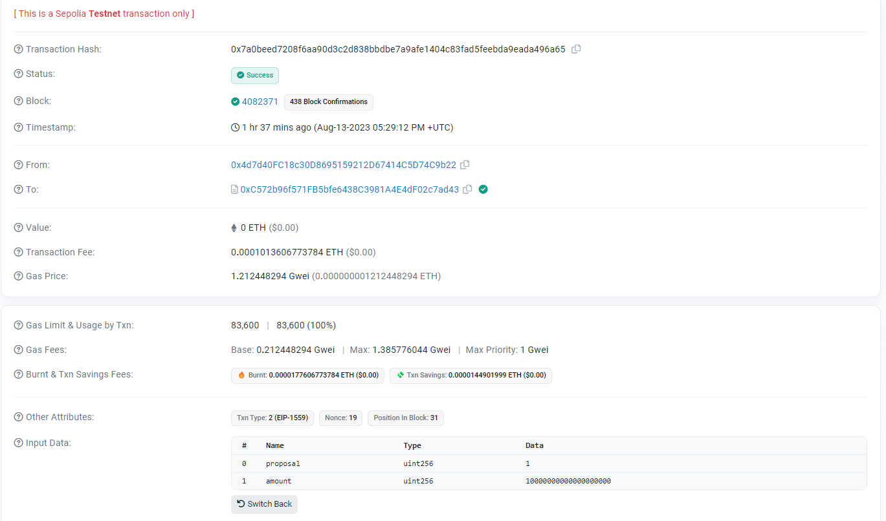
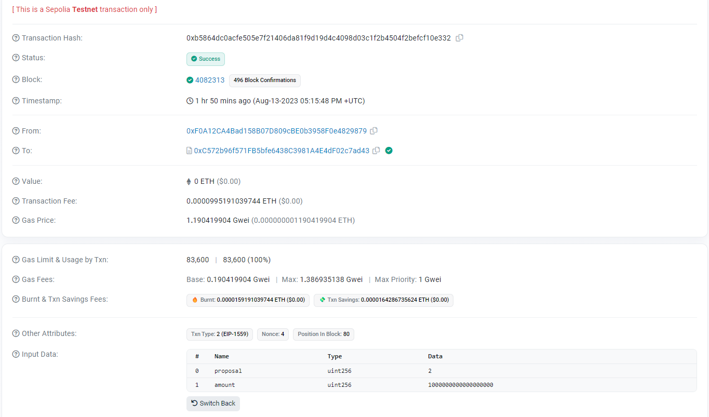
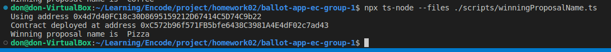

# ballot-app-ec-group-1
### Encode Club Solidity Bootcamp - Group 1 Ballot App Homework
---
- [Token Creation](https://sepolia.etherscan.io/tx/0xd932c2bdde28417a6fae472434c2ef5773015a06aca800d9916794a760898950)

- [Grant Minter Role](https://sepolia.etherscan.io/address/0x83555b198fb77d64b296d5963203b4a160c241bc#events)

- [Minted Tokens](https://sepolia.etherscan.io/address/0x83555b198fb77d64b296d5963203b4a160c241bc#events)

- [TokenizedBallot Creation](https://sepolia.etherscan.io/tx/0xeb96b266ccefa707ac96d3f76b225e4fa3770f28b4c578f9b2666ed69c4180dc)

- [Vote #1](https://sepolia.etherscan.io/tx/0x04a38b5b5ad12425b38ad21ee5e1ddf9be4a6c5754f2a0aa237ba9ea048d546d)

- [Vote #2](https://sepolia.etherscan.io/tx/0x84998edc659ea945686760198c41c244035584f65b1fda2d7d3e158691674cd5)

- [Vote #3](https://sepolia.etherscan.io/tx/0x7a0beed7208f6aa90d3c2d838bbdbe7a9afe1404c83fad5feebda9eada496a65)

- [Vote #4](https://sepolia.etherscan.io/tx/0xb5864dc0acfe505e7f21406da81f9d19d4c4098d03c1f2b4504f2befcf10e332)

- Ballot: what is your favorite food?
  - Burgers
  - Pizza
  - Pasta
- Winning proposal:

- Winning proposal name:
